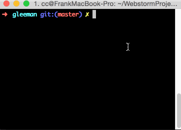

# grunt-pump-version

> Increment project version after finish a hotfix or new feature and do a commit. 

#Install

> npm install grunt-pump-version

#Usage

- Install [grunt-cli](https://github.com/gruntjs/grunt-cli)
- Install `grunt-pump-version`
- Add a `Gruntfile` like [this](./playground/Gruntfile.js).
- Rock and roll

#Try

You can try in [playground](./playground) before using in product environment.
